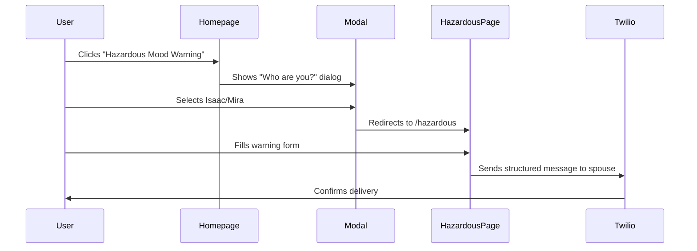
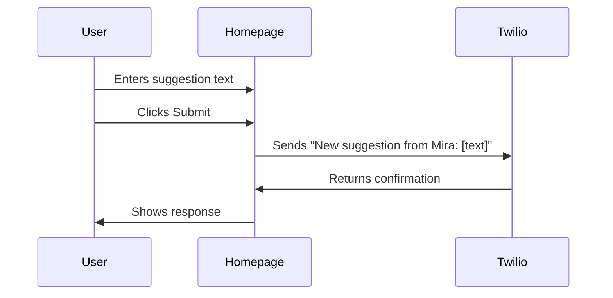
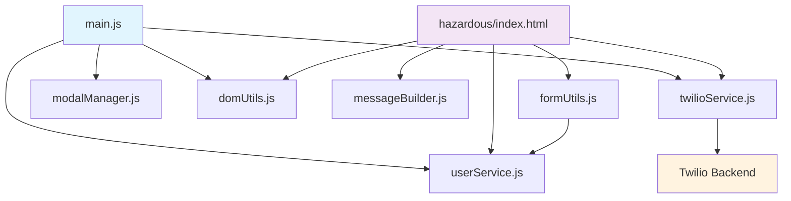

# LLM README
This is not comprehensive documentation for humans, but rather for LLMs to read to have a better sense of the codebase before making changes.

# for-mira: Personal Project Hub & Messaging System

A modular web application serving as a personal project hub with integrated Twilio messaging capabilities. Built for Isaac and Mira as a central place to host interactive tools and communicate through automated SMS.

## 🎯 Project Overview

**Purpose**: A homepage that hosts multiple interactive projects, starting with a "Hazardous Mood Warning" system and expandable suggestion submission feature.

**Core Features**:
- 🏠 **Homepage Hub**: Central dashboard with project buttons and suggestion input
- ⚠️ **Hazardous Mood Warning**: Interactive form that sends structured SMS warnings between spouses
- 💡 **Suggestion System**: Text input that routes ideas to Isaac via Twilio
- 👤 **User Selection Modal**: Login system that determines message routing
- 📱 **Twilio Integration**: Real SMS delivery through custom backend endpoint

## 🚀 User Experience Flows

### Homepage Flow
1. User visits `cissna.github.io/for-mira`
2. Sees project buttons and suggestion input area
3. Can either:
   - Click "Hazardous Mood Warning" → triggers user selection modal
   - Enter suggestion text → submits directly to Isaac

### Hazardous Warning Flow


### Suggestion Flow


## 📁 Directory Structure

```
for-mira/
├── index.html                    # Main homepage with project hub
├── hazardous/
│   └── index.html               # Hazardous mood warning form
├── css/
│   └── styles.css               # Complete styling (homepage + forms + modals)
├── js/
│   ├── main.js                  # Homepage orchestration & event handling
│   ├── services/
│   │   ├── twilioService.js     # Core Twilio API integration
│   │   └── userService.js       # User management & localStorage
│   ├── utils/
│   │   ├── messageBuilder.js    # Message construction logic
│   │   ├── formUtils.js         # Form handling utilities
│   │   └── domUtils.js          # DOM manipulation helpers
│   └── components/
│       └── modalManager.js      # Modal show/hide/event logic
├── .gitignore                   # Ignores *.md except README.md
├── FIRST_THING.md              # Original transformation plan (detailed)
└── REFACTORING_PLAN.md         # Modular architecture plan
```

### Key File Purposes

- **[`index.html`](index.html)**: Homepage with project buttons and suggestion textarea
- **[`hazardous/index.html`](hazardous/index.html)**: Standalone warning form with inline module imports
- **[`css/styles.css`](css/styles.css)**: Unified styling for all pages (responsive, modal-aware)
- **[`js/main.js`](js/main.js)**: Homepage controller, modal management, suggestion submission
- **Planning docs**: [`FIRST_THING.md`](FIRST_THING.md) and [`REFACTORING_PLAN.md`](REFACTORING_PLAN.md) contain architectural decisions and future roadmaps

## 🏗️ JavaScript Architecture

### Module Dependency Flow


### Service Layer (`js/services/`)

#### [`twilioService.js`](js/services/twilioService.js)
**Core Twilio API integration**
- `sendTwilioMessage(receiver, body, endpoint)`: Base sending function
- `sendToSpouse(body, currentUser)`: Routes to opposite user (Isaac ↔ Mira)
- `sendToIsaac(body)`: Direct routing for suggestions

**API Contract**:
```javascript
// Endpoint: https://backend-5491.twil.io/main
// Method: POST
// Content-Type: application/x-www-form-urlencoded
// Body: receiver=[username]&body=[message]
```

#### [`userService.js`](js/services/userService.js)
**User state management**
- `setUser(username)`: Store current user in localStorage
- `getUser()`: Retrieve current user
- `getOppositeUser(username)`: Get message recipient for spouse messaging
- `validateUser(username)`: Ensure username is "isaac" or "mira"

**Storage Key**: `'chosenUser'` in localStorage

### Utils Layer (`js/utils/`)

#### [`messageBuilder.js`](js/utils/messageBuilder.js)
**Message construction logic**
- `buildHazardousWarningMessage(payload)`: Creates structured warning with reasons
- Handles "all of the above" checkbox logic
- Formats optional "further instructions"

**Warning Message Template**:
```
YOU ARE RECEIVING A WARNING FROM YOUR SPOUSE.
They are in a potentially hazardous mood today, according to them because of
- [Reason 1]
- [Reason 2]
Please be cautious and keep your distance and/or purchase gifts.

FURTHER INSTRUCTIONS:
[Optional additional text]
```

#### [`formUtils.js`](js/utils/formUtils.js)
**Form data processing**
- `collectForm(form)`: Converts FormData to object, handles multiple values, adds current user
- `sanitizeInput(input)`: Basic text cleanup
- `validateFormData(data, rules)`: Extensible validation system

#### [`domUtils.js`](js/utils/domUtils.js)
**DOM manipulation helpers**
- `showLoading(elementId)`: Display "…sending" state
- `displayError(elementId, message)`: Show error with 🚫 prefix
- `displaySuccess(elementId, message)`: Show success response
- `addClass(elementId, className)`: Safe class manipulation

### Components Layer (`js/components/`)

#### [`modalManager.js`](js/components/modalManager.js)
**Modal system management**
- `showModal(modalId)`: Remove 'hidden' class
- `hideModal(modalId)`: Add 'hidden' class
- `initializeModal(modalId, config)`: Setup event listeners
- Supports click-outside-to-close and close button patterns

## 📱 Messaging System Details

### User Mapping & Routing
- **Isaac** → sends to **Mira**
- **Mira** → sends to **Isaac**
- **Suggestions** → always route to **Isaac** (regardless of sender)

### Message Types

#### 1. Hazardous Warning Messages
**Trigger**: Form submission from [`hazardous/index.html`](hazardous/index.html)
**Builder**: [`buildHazardousWarningMessage()`](js/utils/messageBuilder.js:8)
**Routing**: Sender's spouse (opposite user)

**Checkbox Logic**:
- Individual reasons: "Something you did", "Something outside of your control", etc.
- "All of the above": Automatically selects all individual reasons
- Bi-directional sync: Checking all individuals auto-checks "all"

#### 2. Suggestion Messages
**Trigger**: Textarea submission from homepage
**Format**: `"New suggestion from Mira:\n[text]"`
**Routing**: Always to Isaac
**Handler**: [`submitSuggestionToTwilio()`](js/main.js:77) in main.js

### Backend Integration
**Endpoint**: `https://backend-5491.twil.io/main`
**Authentication**: None (endpoint handles auth internally)
**Rate Limiting**: Unknown (handled by Twilio backend)
**Error Handling**: Network errors and HTTP status errors are caught and displayed

## 🎨 CSS & UI Architecture

### Design System
**Reset**: Universal `* { margin:0; padding:0; box-sizing:border-box }`
**Typography**: `font-family: system-ui` for native OS appearance
**Responsive**: `clamp()` functions and mobile-first media queries

### Component Styling Patterns

#### Login Buttons
```css
.login-btn {
  font-size: clamp(1.3rem, 4vw, 2.5rem);  /* Responsive sizing */
  transform: scale(1.08) on hover;          /* Subtle interaction */
}
#btn-isaac { background: #05a3c7; }        /* Isaac = blue */
#btn-mira  { background: #7a0bd5; }        /* Mira = purple */
```

#### Form Styling (Hazardous Page)
- **Container**: `#f9f9f4` background with `#d1c7b7` border (mimics "official warning" aesthetic)
- **Grid Layout**: `grid-template-columns: 1fr 1fr` for checkbox pairs
- **Form Lines**: `border-bottom: 2px solid #999` for visual separation

#### Homepage Styling
- **Project Buttons**: Red gradient (`#ef3f1c` to `#ec5e2a`) with hover lift effect
- **Suggestion Input**: Full-width textarea with focus states
- **Modal System**: Fixed overlay with centered content, click-outside-to-close

#### Responsive Breakpoints
- **Mobile** (`max-width: 768px`): Single-column project grid, reduced padding
- **Desktop**: Multi-column grid, full spacing

### CSS Quirks & Nuances
1. **Duplicate CSS**: Lines 149-171 in [`styles.css`](css/styles.css) contain duplicate `#suggestions-input` rules (intentional or oversight?)
2. **Commented Background**: Lines 142-147 show commented-out gray background for suggestions container
3. **Modal Z-Index**: Set to `1000` to ensure overlay precedence

## 📋 Planning & Documentation Files

### [`FIRST_THING.md`](FIRST_THING.md)
**Purpose**: Original transformation plan from simple login to project hub
**Contents**: 
- Detailed UI mockups and user flow diagrams
- Complete HTML/CSS/JS implementation examples
- Phase-by-phase development timeline
- Success criteria and testing checklist

**When to Update**: When adding new project types or major UI changes

### [`REFACTORING_PLAN.md`](REFACTORING_PLAN.md)
**Purpose**: Modular architecture migration plan
**Contents**:
- Analysis of code organization issues
- Proposed file structure (services/utils/components)
- Implementation phases and technical specifications
- Benefits and migration strategy

**When to Update**: When considering architectural changes or adding complex features

### Documentation Hierarchy
1. **`README.md`** (this file): Current state, how everything works
2. **`FIRST_THING.md`**: Historical context, original vision
3. **`REFACTORING_PLAN.md`**: Future architecture, technical debt resolution

## 🔧 Extensibility Guide

### Adding New Projects
1. **HTML**: Add button to `.project-grid` in [`index.html`](index.html:20)
2. **CSS**: Style new button (follow `.project-btn` pattern)
3. **JavaScript**: Add click handler in [`main.js`](js/main.js) DOMContentLoaded event
4. **Implementation**: Create new page/modal or extend existing functionality

### Adding New Message Types
1. **Message Builder**: Add function to [`messageBuilder.js`](js/utils/messageBuilder.js)
2. **Twilio Service**: Add convenience function to [`twilioService.js`](js/services/twilioService.js)
3. **Form Handler**: Use [`formUtils.js`](js/utils/formUtils.js) for data collection
4. **UI Feedback**: Use [`domUtils.js`](js/utils/domUtils.js) for loading/success/error states

### Configuration Management
Currently configuration is embedded in modules. For complex setups, consider:
- Create `js/config/config.js` for centralized constants
- Environment-specific endpoints
- Feature flags for experimental functionality

## ⚠️ Known Nuances & Gotchas

### JavaScript Behavior
1. **Module Exports**: [`main.js`](js/main.js:9) exports functions for backward compatibility with hazardous page
2. **User Persistence**: User selection persists in localStorage across sessions
3. **Modal State**: Modals use CSS `hidden` class, not `display: none` inline styles
4. **Form Collection**: [`collectForm()`](js/utils/formUtils.js:10) automatically handles multiple values as arrays
5. **Error Display**: All errors get 🚫 emoji prefix via [`displayError()`](js/utils/domUtils.js:38)

### CSS Behavior
1. **Responsive Text**: Extensive use of `clamp()` for fluid typography
2. **Transform Effects**: Hover states use `transform` instead of `transition` for performance
3. **Grid Auto-Fit**: Project grid uses `repeat(auto-fit, minmax(250px, 1fr))` for flexible layouts

### User Experience
1. **Suggestion Routing**: All suggestions go to Isaac regardless of who submits them
2. **Modal Persistence**: User selection modal appears every time hazardous warning is accessed
3. **Loading States**: Form submissions show "…sending" before API response
4. **Checkbox Logic**: "All of the above" checkbox has bidirectional sync with individual options

### Backend Dependencies
1. **Twilio Endpoint**: Hardcoded to `https://backend-5491.twil.io/main`
2. **Content-Type**: Must be `application/x-www-form-urlencoded` (not JSON)
3. **Parameter Names**: Exactly `receiver` and `body` (case-sensitive)
4. **User Names**: Must be lowercase "isaac" or "mira"

## 🔍 AI Development Notes

### For Future Code Modifications
1. **Module Imports**: All pages use ES6 modules with explicit imports
2. **Error Handling**: Wrap Twilio calls in try/catch, use [`displayError()`](js/utils/domUtils.js:38) for user feedback
3. **Form Processing**: Always use [`collectForm()`](js/utils/formUtils.js:10) for consistent data structure
4. **User Context**: Check [`getUser()`](js/services/userService.js:19) for current user context
5. **Message Building**: Use existing builders in [`messageBuilder.js`](js/utils/messageBuilder.js) for consistent formatting

### Testing Considerations
1. **User Switching**: Test both Isaac and Mira user contexts
2. **Modal Interactions**: Verify click-outside-to-close and close button functionality
3. **Form Validation**: Test empty submissions and edge cases
4. **Responsive Design**: Test mobile and desktop layouts
5. **Message Formatting**: Verify message templates match expected SMS format

### Extension Patterns
1. **New Services**: Follow pattern in [`services/`](js/services/) directory
2. **New Utilities**: Follow pattern in [`utils/`](js/utils/) directory  
3. **New Components**: Follow pattern in [`components/`](js/components/) directory
4. **Configuration**: Consider centralizing constants if complexity grows

---

## 🚀 Quick Start

1. **Local Development**: Open [`index.html`](index.html) in browser (no build process required)
2. **User Testing**: Select Isaac or Mira in modal to test different message routing
3. **Message Testing**: Use hazardous warning form or suggestion input to test Twilio integration
4. **Code Changes**: Modify modules in [`js/`](js/) directory, refresh browser to see changes

## 📞 Support & Questions

For questions about architecture decisions, see planning documents:
- [`FIRST_THING.md`](FIRST_THING.md) for original vision and UI specifications
- [`REFACTORING_PLAN.md`](REFACTORING_PLAN.md) for technical architecture details

---

*Last Updated: December 2024*
*Architecture: Modular ES6, Responsive CSS, Twilio Integration*
